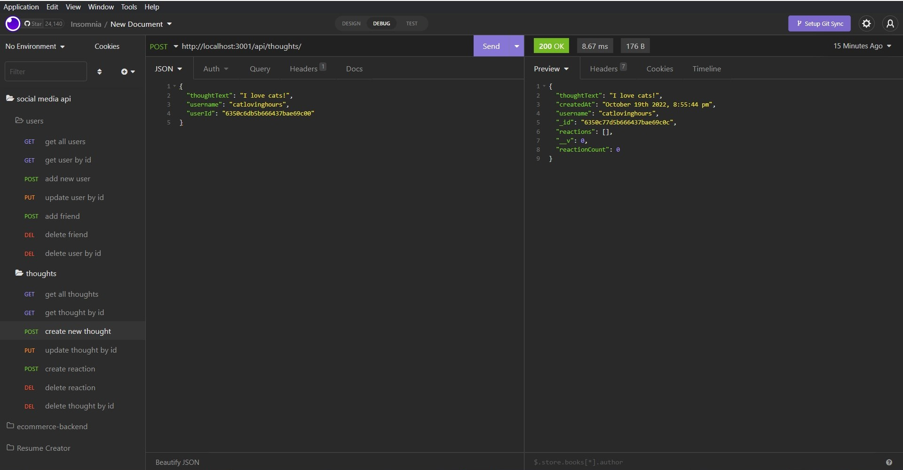

# Deep Thoughts (Social Media API Backend)

## Description

This is a program that allows users to create deep thoughts for their personal accounts. Specifically, the backend portion where all routes to create, update, and delete thoughts are made! This program is made using Mongoose, MongoDB, and express.js.

The program has three models: User, Thought, and Reaction. Users can have multiple Thoughts, and Thoughts can have multiple Reactions. MongoDB is used to store and retrieve all data. When a user creates a thought, that thought ID is added to that user's list of thoughts. Other users can react to their thoughts. They can even add each other as a friend!

## Usage

The program can be run using ``npm start``, which starts up the server on localhost port 3001. The following examples use Insomnia to test out the routes.

This shows how the program displays all users registered in the database. Each user will have a randomly generated userId, username, email, list of thoughts, and list of friends. The thoughts array holds the IDs of the thoughts that they have created. A specific user can be searched for using their userId to display their thoughts or to edit any information. 

Adding a user is as simple as providing a username and a valid email address. The email must be valid or else the user cannot be registered.A User can also be deleted from the database if chosen using their userId. When a User is deleted, all of their associated thoughts will also be deleted from the database.

Users can add another person to their friends list by providing both of their IDs, though it is unfortunately a one way street. (To be mutual friends, both sides must add each other.) However, Users can also delete someone from their friends list by providing their userId and their ex-mutual's userId.

Creating a thought requires the thought's text, the username of the author, and the author's userId. Once created, the new thoughtId will be inserted into that user's thoughts list. Users can also update the thought with new text, and it will find that specific thought in the program and update it accordingly. Likewise, using the thoughtId, the thought can be deleted entirely.

It is also possible to search up all existing thoughts, or search for a thought by a single ID. Searching up a thought using its thoughtId will also display all reactions associated with it.

A reaction can be associated with a thought by putting down the reactionBody (aka the reaction the user wants to use) and the username of the person who created the reaction. The route will require the thoughtId of the thought that is being reacted to. A newly created reaction will also have a random reactionId. That reactionId can be used to delete the reaction from the thought, which also requires the original thought's thoughtId in order for the route to work.

## Links

Walkthrough video detailing program: [https://drive.google.com/file/d/196CA9pctfKXtqjYmc6JiSuvgQDHcU_yv/view](https://drive.google.com/file/d/196CA9pctfKXtqjYmc6JiSuvgQDHcU_yv/view)

Link to GitHub repository: [https://github.com/cindyung56/deep-thoughts](https://github.com/cindyung56/deep-thoughts)